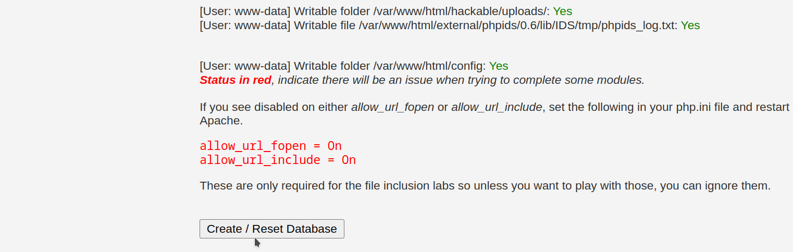

# PPS-Unidad3Actividad1-Virgilio
Actividad 1 de la Unidad 3 de Puesta en Producción Segura. Creación de entornos de pruebas. 

Tenemos como objetivo:

> [Crear entorno de máquinas vulnerables](#Entorno-de-maquinas-vulnerables)

> [Crear un entorno de pruebas de vulnerabilidades](#Entorno-de-pruebas)

---
## Entorno de maquinas vulnerables

Hemos visto como, entre la información de fuentes abiertas que tenemos a nuestro alcance, hay proyectos creados con máquinas deliberadamente vulnerables para que podamos entrenar con ellas.

Entre las muchas que hay podemos encontrar los siguientes proyectos: 

1. [DAMN VULNERABLE WEB APPLICATION \(DVWA\)](https://github.com/digininja/DVWA/blob/master/README.es.md) 
2. [Buggy Web APPlication \(BWAPP\)](http://www.itsecgames.com/) 
3. [OWASP Multillidae II](https://owasp.org/www-project-mutillidae-ii/)

Para ello tan sólo tenemos que realizar los siguientes pasos:
1. Crea una carpeta con nombre entorno-vulnerables-tunombre
2. Coloca dentro de ella el archivo [docker-compose.yml](./entornoMaquinasInseguras/docker-compose.yml) que tienes en la carpeta entornoMaquinasInseguras de este repositorio: 
3. Levanta el escenario multicontedor con `docker-compose up -d`

> Las máquinas vulnerables que hemos creado son:
>> **DVWA**.  A esta máquina accedemos a través del puerto **8001**. Es posible que tarde un poco en crear la base de datos o sea que  _un poco de paciencia_ si da error en la BBDD.
>>
>> Por lo tanto accedemos a ella en el enlace: <localhost:8001>. 
>>
>> Podemos acceder con usuario **Admin** y sin contraseña... -o con el que queramos- 
>>
>> Al igual que en bWAPP que veremos a continuación, el primer paso será crear la Base de Datos. 
>>
>> 
>> 
>>
>> Ya con el usuario **admin* y la contraseña **password** podemos hacer a completar los retos que queramos.
>> 
>>
>---
>
>> **bWAPP**. A esta máquina accedemos a través del puerto **8002**. 
>>
>> La primera vez que accedamos nos dará un error ya que no tiene creada la BBDD. 
>>
>> Por lo tanto accedemos a crearla: <http://localhost:8002/install.php> 
>>
>> Y ya podremos acceder pulsando en login o creando un nuevo usuario. Las credenciales de acceso por defecto son usuario: bee, contraseña: bug y podemos seleccionar en este momento el **nivel de seguridad** que queremos que tenga la máquina.
>>
>> 
>> 
>>
>> Y después de acceder podremos realizar un gran número de entrenamientos de explotación de vulnerabilidades.
>>
>> 
>---
>
>> **OWASP Multillidae ii**. A esta máquina accedemos a través del puerto **80** o del **8080**. 
>>
>> Por lo tanto accedemos a ella en el enlace: <http://localhost>. 
>>
>> Al igual que en los casos anteriores, el primer paso será crear la Base de Datos. 
>>
>> 
>>
>> En este caso no necesitamos usuario y contraseña para acceder.
>> 
>> En multillidae tenemos además del servicio de BBDD otros servicios creados:
>> - Servicio PhpAdmin para acceder a las BBDD. Accedemos desde <http://localhost:81>. 
>> 
>>
>> - Servicio PhpLdapAdmin para acceder al servicio de directorio LDAP. Accedemos desde <http://localhost:82>. 
>> 

## Entorno de pruebas

Vamos también a crear un entorno de pruebas en los que vamos a realizar las prácticas, creando servidores y archivos con vulnerabiliades presentes, para corregirlas posteriormente.

Tenemos diferentes opciones para realizarlo, entre ellas:

- Crear una máquina virtual e instalar todo lo necesario: Una pila sea del tipo que sea: LAMP, LEMP, MEAN, XAMPP, WAMP y AMPPS.

- Crear un escenario multicontenedor con cualquiera de esas pilas.

En esta ocasión vamos utilizar la segunda opción, crearemos un escenario multicontenedor con cualquiera de las pilas que nos podemos encontrar en [docker hub](https://hub.docker.com). Yo he utilizado la primera que me he encontrado:[https://github.com/sprintcube/docker-compose-lamp.git](https://github.com/sprintcube/docker-compose-lamp.git)

> Si vemos el repositoio de github.com, el usuario nos dice las operaciones que tenemos que hacer para replicar el escenario:
>
> ~~~
> git clone https://github.com/sprintcube/docker-compose-lamp.git
> cd docker-compose-lamp/
> cp sample.env .env
> // modify sample.env as needed
> docker compose up -d
> // visit localhost
> ~~~
Veamos:
- Clonamos el repositorio en nuestro equipo local.
- Entramos dentro de la carpeta del proyecto.
- Hacemos una copia del fichero sample.env en un fichero llamado .env.
Démonos cuenta que este fichero es el que contiene las variables que se van a utilizar en las diferentes máquinas que vamos a crear. si lo abrimos, tiene este aspecto: 

~~~
# Please Note:
# In PHP Versions <= 7.4 MySQL8 is not supported due to lacking pdo support

# To determine the name of your containers
COMPOSE_PROJECT_NAME=lamp

# Possible values: php54, php56, php71, php72, php73, php74, php8, php81, php82, php83
PHPVERSION=php83
DOCUMENT_ROOT=./www
APACHE_DOCUMENT_ROOT=/var/www/html
VHOSTS_DIR=./config/vhosts
APACHE_LOG_DIR=./logs/apache2
PHP_INI=./config/php/php.ini
SSL_DIR=./config/ssl

# PHPMyAdmin
UPLOAD_LIMIT=512M
MEMORY_LIMIT=512M

# Xdebug
XDEBUG_LOG_DIR=./logs/xdebug
XDEBUG_PORT=9003
#XDEBUG_PORT=9000

# Possible values: mysql57, mysql8, mariadb103, mariadb104, mariadb105, mariadb106
#
# For Apple Silicon User: 
# Please select Mariadb as Database. Oracle doesn't build their SQL Containers for the arm Architecure

DATABASE=mysql8
MYSQL_INITDB_DIR=./config/initdb
MYSQL_DATA_DIR=./data/mysql
MYSQL_LOG_DIR=./logs/mysql

# If you already have the port 80 in use, you can change it (for example if you have Apache)
HOST_MACHINE_UNSECURE_HOST_PORT=80

# If you already have the port 443 in use, you can change it (for example if you have Apache)
HOST_MACHINE_SECURE_HOST_PORT=443

# If you already have the port 3306 in use, you can change it (for example if you have MySQL)
HOST_MACHINE_MYSQL_PORT=3306

# If you already have the port 8080 in use, you can change it (for example if you have PMA)
HOST_MACHINE_PMA_PORT=8080
HOST_MACHINE_PMA_SECURE_PORT=8443

# If you already has the port 6379 in use, you can change it (for example if you have Redis)
HOST_MACHINE_REDIS_PORT=6379

# MySQL root user password
MYSQL_ROOT_PASSWORD=tiger

# Database settings: Username, password and database name
#
# If you need to give the docker user access to more databases than the "docker" db 
# you can grant the privileges with phpmyadmin to the user.
MYSQL_USER=docker
MYSQL_PASSWORD=docker
MYSQL_DATABASE=docker
~~~
Podemos ver como dentro de las variables que se crean aquí, muchas de ellas tienen que ver con versiones, rutas, y nombres y otras con contraseñas.
Podemos cambiar aquí, entre otras cosas, la versión de PHP y BBDD a utilizar, que por defecto está la 8.3 de PHP y mySQL8 como BBDD. También, si lo deseamos las rutas del servidor web, archivos de configuración, certificados, bases de datos, etc...
Por otra parte tenemos también los puertos que utilizarán las máquinas y las contraseñas de la máquina de mysql, tanto de administración como de usuario, y nombre de BBDD a crear.
> Recordemos como dentro del top 10 de OWASP tenemos la categoría de __Configuración Insegura__. Alguna de las vulnerabilidades atacan precisamente, las contraseñas por defecto, etc... por lo que si queremos seguir buenas prácticas, deberíamos de cambiar al menos:
> - Puertos que utilizaremos
> - Contraseñas de:
> 	- Administrador de BBDD
>	- Usuario de BBDD
> - Nombres de:
>	- BBDD
>	- Usuario de BBDD

Aquí finalizaría la configuración de nuestro escenario multicontenedor. Seguimos con pasos:
- Levantar el escenario con docker-compose up -d 

... pero antes, veamos el archivos docker-compose.yml para comprobar que:

Se levantan tres servicios o contenedores diferentes:

1. Servicio __webserver__ que nos proveerá del servicio web con una máquina Apache con el PHP que hayamos decidido.
2. Servicio __database__ que contrendrá la base de datos mySQL8.
3. Un servidor web para administrar la Base de datos: PHPMyAdmin.
4. Una base de datos no SQL: Redis, que se suele utilizar como caché de aplicaciones.
Ya si podemos levantar el escenario multicontenedor:
~~~
docker-compose up -d
~~~

Y si todo va bien, tendremos nuestro escenario levantado:

> Para 
>[https://uniwebsidad.com/libros/python/capitulo-2/elementos-del-lenguaje](https://uniwebsidad.com/libros/python/capitulo-2/elementos-del-lenguaje)

>[https://protegermipc.net/2019/05/22/libro-python-basico-para-hackers-y-pentester](https://protegermipc.net/2019/05/22/libro-python-basico-para-hackers-y-pentester)

---
[## ENTREGA](/Entrega.md)

>__Implementa los dos entornos indicados__

>__Crea un repositorio  con nombre PPS-Unidad3Actividad1-Tu-Nombre donde documentes la realización de ellos.__

> No te olvides de documentarlo convenientemente con explicaciones, capturas de pantalla, etc.

>__Sube a la plataforma, tanto el repositorio comprimido como la dirección https a tu repositorio de Github.__
